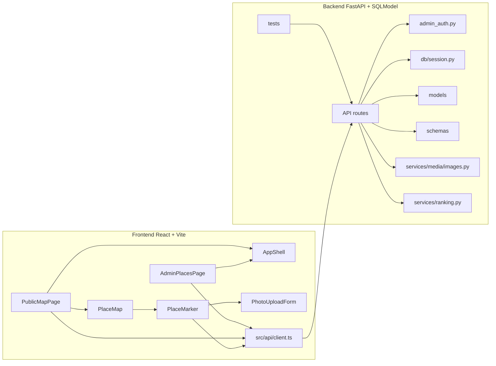
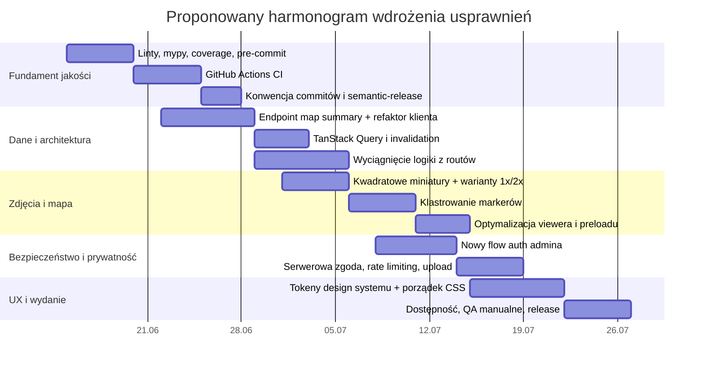

# Audyt repozytorium PhotoMaps

## Podsumowanie wykonawcze

PhotoMaps jest dziś niewielką aplikacją webową z frontendem w React + Vite + Leaflet/React Leaflet oraz backendem w FastAPI + SQLModel + Pillow. Repozytorium ma czytelny podział na `frontend`, `backend`, `docs` i `scripts`, a README opisuje dwa główne ekrany: publiczną mapę pod `/` i prosty panel redakcyjny pod `/admin`. W warstwie zależności widać minimalny, dość lekki stos: po stronie frontendu React 18, Vite, TypeScript, Leaflet i `lucide-react`, a po stronie backendu FastAPI, SQLModel, Pillow, `pytest` i `ruff`. citeturn41view0turn41view1turn41view2

Największe plusy obecnej wersji to: sensowny rozdział modeli/schematów/routingu, walidacja zgodności schematu bazy przy starcie, rozdzielenie storage publicznego i prywatnego dla zdjęć oraz podstawowe zabezpieczenia ścieżek plików. Dodatkowo pipeline zdjęć obraca obraz według EXIF, normalizuje go do RGB i generuje osobno publiczną kopię oraz miniaturę, a README wprost opisuje moderację zdjęć i brak EXIF w publicznych pochodnych. To dobry fundament pod dalsze utwardzenie aplikacji. citeturn18view1turn26view0turn26view1turn26view2turn41view0

Najważniejsze słabości są jednak konkretne i dość łatwe do wskazania. Po pierwsze, ekran mapy wykonuje klasyczne N+1 po stronie klienta: po `getPlaces()` uruchamia `Promise.all()` z `getPlacePhotos(place.id)` dla każdego miejsca, co będzie się źle skalować wraz z liczbą punktów i zdjęć. Po drugie, mapa renderuje każde miejsce jako osobny `PlaceMarker` bez klastrowania, a dodatkowo rozwija zdjęcia w niestandardowy „wachlarz” markerów, co jest efektowne, ale kosztowne i trudne do utrzymania przy większej gęstości danych. Po trzecie, spora część logiki biznesowej siedzi bezpośrednio w handlerach FastAPI, a warstwa frontendu opiera się na kilku bardzo dużych, globalnych plikach CSS i kilku cięższych komponentach kontrolujących stan, widoki i pobieranie danych naraz. Po czwarte, w repozytorium nie widać workflowów GitHub Actions ani opublikowanych wydań, a w `package.json` brak skryptów do testów i lintingu frontendu. Po piąte, panel admina opiera się na jednym bearer tokenie przechowywanym w `sessionStorage`, a zgoda na publikację zdjęcia istnieje po stronie UI, ale nie jest utrwalana ani egzekwowana po stronie API. citeturn39view0turn39view1turn38view1turn40view3turn25view0turn25view1turn25view2turn30view6turn30view7turn30view8turn30view9turn30view10turn30view11turn30view12turn41view0turn41view1turn45view1turn45view2turn39view2turn39view3turn28view0

Gdybym miał ustawić plan prac na najbliższy miesiąc, kolejność byłaby następująca. Najpierw ograniczenie ruchu i uproszczenie modelu danych dla mapy przez endpointy streszczeniowe oraz cache stanu serwerowego na froncie. Równolegle dołożenie pełnego pasa jakości: ESLint, Ruff, mypy, Vitest, Playwright, coverage i pre-commit. Następnie utwardzenie bezpieczeństwa wokół uploadów i panelu admina. Dopiero potem refaktor warstwy wizualnej na tokeny projektowe i bardziej modularne style oraz poprawa prezentacji zdjęć na mapie przez klastrowanie, kwadratowe kadrowanie miniatur, warianty 1x/2x i progresywne ładowanie. Ten zestaw zmian najlepiej odpowiada temu, co już widać w kodzie oraz temu, do czego zostały zaprojektowane rekomendowane narzędzia i biblioteki. citeturn44search2turn44search6turn44search10turn44search14turn42search0turn42search1turn42search9turn42search2turn42search10turn42search3turn44search0turn44search21turn43search0turn43search4

| Priorytet | Rekomendacja | Wpływ | Wysiłek | Dlaczego teraz |
|---|---|---:|---:|---|
| P0 | Zastąpić N+1 na mapie endpointem streszczeniowym + cache klienta | bardzo wysoki | średni | Ekran mapy pobiera listę miejsc, a potem osobno zdjęcia dla każdego miejsca. citeturn39view0turn39view1turn44search2turn44search10 |
| P0 | Dodać frontendowe testy, linting i CI | bardzo wysoki | średni | Frontend nie ma skryptów test/lint, a w repo nie widać workflowów CI. citeturn41view1turn41view0turn44search0turn42search0turn42search1 |
| P0 | Utwardzić auth admina i upload zdjęć | bardzo wysoki | średni | Token admina siedzi w `sessionStorage`, zgoda na publikację jest tylko po stronie UI, upload czyta cały plik do pamięci. citeturn45view1turn45view2turn39view2turn39view3turn26view0turn26view1 |
| P1 | Wprowadzić klastrowanie markerów i warianty miniatur | wysoki | średni | Dziś renderowane są wszystkie markery osobno, bez klastra, a miniatura ma tylko jeden wariant. citeturn38view1turn40view3turn26view2turn43search0turn43search4 |
| P1 | Rozbić logikę routów i zunifikować style przez tokeny | wysoki | średni/wysoki | Reguły domenowe są inline w routach, a style są rozlane po wielu dużych plikach globalnych. citeturn25view0turn25view1turn25view2turn30view6turn30view9turn30view11 |

## Zakres badania i mapa repozytorium

Badanie zacząłem od wskazanego przez Ciebie repozytorium na GitHubie i to ono było źródłem pierwszego rzędu dla oceny kodu, struktury katalogów, skryptów, API i aktualnego kształtu UI. Po tym etapie dobrałem dodatkowe źródła wysokiej jakości: dokumentacje oficjalne GitHub Actions, Vitest, Playwright, Ruff, mypy, TanStack Query, React Router, React Leaflet, Leaflet.markercluster, WCAG oraz polskie materiały rządowe o dostępności cyfrowej. Ponieważ repozytorium wskazuje webowy stack React/Vite + FastAPI, a nie pokazuje żadnego kodu mobilnego czy desktopowego, dalsze rekomendacje utrzymują obecny stack i traktują platformę docelową jako aplikację webową; wszystko, czego nie da się wywnioskować z repo, oznaczam jako nieokreślone. citeturn41view0turn41view1turn41view2turn42search0turn42search1turn42search2turn42search3turn43search1turn43search0turn44search0turn44search2turn44search3turn46search0turn46search1turn46search2turn46search3

Na poziomie makro repozytorium wygląda sensownie: backend skupia API, modele, schematy, usługi mediów i testy; frontend skupia klienta API, strony, komponenty map/admina/uploadu i dużą warstwę CSS; obok stoją `docs` i `scripts`. W README opisano podstawowe endpointy i ręczne komendy uruchomieniowe dla obu części. citeturn41view0turn14view5turn31view0turn31view1turn31view2turn31view3

```text
PhotoMaps/
├─ backend/
│  ├─ app/
│  │  ├─ api/
│  │  │  ├─ admin_auth.py
│  │  │  └─ routes/
│  │  │     ├─ categories.py
│  │  │     ├─ places.py
│  │  │     ├─ photos.py
│  │  │     ├─ admin_categories.py
│  │  │     ├─ admin_places.py
│  │  │     └─ admin_photos.py
│  │  ├─ core/
│  │  ├─ db/session.py
│  │  ├─ models/{category,place,photo}.py
│  │  ├─ schemas/{category,place,photo}.py
│  │  ├─ services/
│  │  │  ├─ ranking.py
│  │  │  └─ media/images.py
│  │  └─ tests/
│  │     ├─ test_categories.py
│  │     ├─ test_photos.py
│  │     ├─ test_places.py
│  │     └─ test_schema_validation.py
├─ frontend/
│  ├─ src/
│  │  ├─ api/client.ts
│  │  ├─ pages/{PublicMapPage,AdminPlacesPage}.tsx
│  │  ├─ components/
│  │  │  ├─ admin/{AdminAccessGate,CategoryManager,PhotoQueue,PlaceForm,PlaceLocationPicker,SystemModal}.tsx
│  │  │  ├─ layout/AppShell.tsx
│  │  │  ├─ map/{DistanceMeasureTool,PlaceMap,PlaceMarker}.tsx
│  │  │  └─ places/PhotoUploadForm.tsx
│  │  └─ styles/{admin,app,base,layout,map-tools,map,responsive}.css
├─ docs/
├─ scripts/
├─ README.md
└─ AGENTS.md
```

Poniższy diagram dobrze opisuje aktualne zależności funkcjonalne, które widać bezpośrednio w kodzie: publiczna mapa i panel admina rozmawiają przez `src/api/client.ts` z routami FastAPI; backend mapuje dane przez modele i schematy SQLModel; upload obrazów idzie przez `services/media/images.py`; logika „scoringu” jest wydzielona, ale bardzo mała. citeturn39view1turn45view1turn29view0turn24view2turn25view0turn25view1turn25view2turn26view0turn21view2



## Zwięzły audyt repozytorium

| Obszar | Co działa dobrze | Co jest ryzykiem lub długiem |
|---|---|---|
| Architektura backendu | Widać podstawowy porządek: osobne modele, schematy, routing, mała warstwa usług i testy. `db/session.py` tworzy tabele i waliduje zgodność schematu z modelami przy starcie. citeturn14view5turn18view1 | Większość reguł domenowych siedzi w handlerach FastAPI, nie w usługach. Dotyczy to walidacji statusów, slugów, aktywności kategorii, przejść statusów zdjęć i aktualizacji liczników. To utrudnia testowanie jednostkowe i rozszerzanie logiki. citeturn25view0turn25view1turn25view2turn26view3turn26view4turn27view0turn27view1turn28view3 |
| Model domeny | `Place`, `Photo` i `Category` są czytelne, a `Photo` ma jawne ścieżki do oryginału, publicznej wersji i miniatury. citeturn17view2turn17view3turn18view0 | W modelu `Place` występuje `memory_count`, schematy go eksponują, a `place_score` go wykorzystuje, ale w widocznej strukturze API nie ma encji „memory” ani routów obsługujących tę część domeny. To wygląda jak martwy lub niedokończony koncept. citeturn18view0turn25view4turn21view2turn21view4 |
| API i dane | `src/api/client.ts` centralizuje typy i wywołania HTTP; backend ma osobne endpointy publiczne i administracyjne. citeturn45view1turn45view2turn41view0 | Publiczna mapa robi N+1: najpierw pobiera miejsca, potem zdjęcia dla każdego miejsca z osobna. Dodatkowo `place_score()` jest wyliczany i zwracany w `PlaceRead`, ale publiczna lista sortuje po `weight` i `created_at`, a nie po samym wyniku. To znaczy, że logika rankingu istnieje, lecz nie steruje głównym widokiem. citeturn39view0turn39view1turn21view2turn24view1turn29view0 |
| Frontend i modularność | Dostępne są osobne komponenty dla mapy, admina, uploadu i shella aplikacji. Jest też rozbudowane narzędzie pomiaru odległości, co pokazuje, że aplikacja ma już bardziej ambitne interakcje niż tylko statyczne markery. citeturn31view0turn31view1turn31view2turn31view3turn40view6turn39view5 | `PublicMapPage` i `AdminPlacesPage` są kontenerami pobierania danych i sterowania ekranami, a stylowanie jest rozrzucone po wielu dużych arkuszach globalnych (`admin.css`, `layout.css`, `map.css`, `base.css`, `responsive.css`, `map-tools.css`). `AppShell` zawiera też pozycje menu bez realnych tras lub akcji, co wygląda bardziej jak makieta IA niż finalna nawigacja. citeturn39view1turn38view7turn30view6turn30view8turn30view9turn30view10turn30view11turn30view12turn39view4 |
| Zdjęcia i mapa | `PlaceMarker` ma ciekawy, niestandardowy wzorzec: marker z obrazem okładkowym, rozwijalny wachlarz miniatur, popup uploadu i fullscreenowy viewer zdjęcia. To jest atrakcyjne demo produktu. citeturn40view3turn38view4 | Na mapie nie ma klastrowania; `PlaceMap` renderuje każdy `PlaceMarker` osobno, a marker zdjęciowy jest budowany przez `L.divIcon`. Viewer pokazuje po prostu ``, bez `srcset`, `decoding`, prefetchingu i bez jawnego focus trap. To rozwiązanie będzie kosztowne dla wydajności i słabsze dostępnościowo przy większym ruchu. citeturn38view1turn40view3turn38view4turn43search1turn43search9 |
| Upload i przetwarzanie obrazów | Backend sprawdza rozmiar pliku, używa Pillow do walidacji, normalizuje orientację i broni się przed wyjściem poza katalog storage przez `storage_path`. citeturn26view0turn26view1 | Pipeline czyta cały upload do pamięci (`await upload.read()`), a następnie generuje tylko jedną publiczną wersję JPEG do 1800 px i jedną miniaturę do 520 px przez `thumbnail()`, czyli bez kontrolowanego cropu. Nie widać też serwerowego limitu liczby pikseli ani wariantów 1x/2x dla ekranów retina. citeturn26view0turn26view1turn26view2 |
| Testy i diagnostyka | Backend ma testy `pytest` dla kategorii, miejsc, zdjęć i walidacji schematu, a README każe uruchamiać `pytest` oraz `python -m compileall app`. W `requirements.txt` obecny jest też `ruff`. citeturn14view5turn41view0turn41view2 | Frontend nie ma w `package.json` żadnych skryptów `test`, `lint` ani `coverage`; w repo nie widać też workflowów GitHub Actions ani opublikowanych wydań. To oznacza, że jakość frontendu jest dziś broniona głównie przez `tsc --noEmit` w buildzie, a nie przez pełny pas jakości. citeturn41view1turn41view0 |
| Bezpieczeństwo i prywatność | Publiczne pochodne obrazów są generowane osobno, a formularz uploadu pyta użytkownika o prawa do publikacji i zgodę rozpoznawalnych osób. Auth admina używa bezpiecznego porównania tokenów `compare_digest`. citeturn41view0turn39view2turn39view3turn17view1 | Zgoda jest tylko stanem UI i nie trafia do backendu ani logów; oryginał zdjęcia jest nadal przechowywany prywatnie; auth administracyjny to jeden bearer token z `sessionStorage`, bez ról, sesji, rotacji, audytu czy expiry. Publiczny upload nie pokazuje też żadnego rate limiting lub anty-spamu po stronie API. citeturn45view1turn45view2turn28view0turn39view2turn39view3turn17view1 |

Najbardziej praktyczne, konkretne problemy, które znalazłem w samym kodzie, są trzy. Pierwszy to kosztowny model pobierania danych na mapie. Drugi to rozjazd między istniejącym modelem rankingu a realnym sortowaniem listy miejsc. Trzeci to niespójna obsługa zdjęcia głównego: przy usunięciu zdjęcia kod szuka następnej okładki, ale przy odrzuceniu zdjęcia okładkowego w moderacji ustawia `cover_photo_id = None` i nie wybiera zastępstwa. To będzie dawało niepotrzebne „dziury” w prezentacji miejsc. citeturn39view0turn39view1turn21view2turn24view1turn26view4turn28view2

## Zalecenia priorytetowe

| Priorytet | Działanie | Oczekiwany efekt | Wysiłek | Podstawa |
|---|---|---|---|---|
| P0 | Dodać do API endpoint lub parametr zwracający dane mapowe w postaci streszczenia miejsca: `id`, `slug`, `title`, `lat`, `lon`, `cover_photo_thumb`, `photo_count`, `score`, dane kategorii. | Jeden request dla mapy zamiast lawiny requestów; prostszy model renderowania markerów; niższy TTFMP i mniej migotania UI. | średni | `PublicMapPage` dziś robi `getPlaces()` + `Promise.all(getPlacePhotos(place.id))`. citeturn39view0turn39view1 |
| P0 | Wprowadzić cache stanu serwerowego po stronie frontendu przez TanStack Query. | Deduping requestów, retry, cache, invalidation po uploadzie i po akcjach admina; mniej ręcznych `setState` oraz mniej błędów starych danych. | średni | TanStack Query jest zaprojektowany właśnie do cache’owania i invalidation danych asynchronicznych, a obecny frontend ręcznie buduje ten stan. citeturn44search2turn44search6turn44search10turn44search14turn39view1 |
| P0 | Wyciągnąć logikę domenową z handlerów FastAPI do warstw `services/` lub `use_cases/`. | Lepsza testowalność, mniej duplikacji, prostsze routy, łatwiejsze rozszerzenia. | średni/wysoki | Walidacje statusów, kategorie aktywne, wybór zdjęcia głównego, liczniki zdjęć i archiwizacja siedzą dziś inline w routach. citeturn25view0turn25view1turn25view2turn26view4turn27view1turn28view3 |
| P0 | Utwardzić upload i panel admina: serwerowo zapisywać deklarację zgody, dodać rate limiting, limit wymiarów obrazu i odejść od wymiany gołego tokena w `sessionStorage` na sesję HTTP-only albo osobny flow logowania admina. | Niższe ryzyko nadużyć, lepsza ścieżka audytowa, mniej ryzyka utraty kontroli nad panelem admina. | średni | Token jest klientowy, upload jest publiczny, a deklaracja zgody nie dociera do API. citeturn45view1turn45view2turn39view2turn39view3turn28view0turn17view1 |
| P1 | Zastąpić miniatury „preserve aspect ratio” miniaturami kwadratowymi z kontrolowanym cropem oraz dodać warianty 1x/2x. | Spójniejsze markery i viewer, lepszy wygląd na mapie, mniejszy bandwidth dla małych ekranów i lepszy efekt na retina. | niski/średni | Dziś miniatura jest tworzona przez `thumbnail(THUMB_SIZE)` i nie ma osobnych wariantów. citeturn26view2 |
| P1 | Dodać klastrowanie markerów na niskich średnich zoomach; zachować „wachlarz” tylko jako detal po wejściu głębiej. | Lepsza czytelność mapy, mniej nakładających się ikon, wyższa wydajność. | średni | `PlaceMap` renderuje każdy marker osobno, a Leaflet.markercluster i wrapper dla React Leaflet rozwiązują dokładnie ten problem. citeturn38view1turn40view3turn43search0turn43search4 |
| P1 | Uporządkować wynik rankingu: albo sortować po `score`, albo usunąć `score` z kontraktu publicznego, jeśli ma pozostać wyłącznie informacyjny. | Mniej niejednoznaczności biznesowej i łatwiejsze strojenie prezentacji miejsc. | niski | `place_score()` istnieje, ale lista publiczna jest sortowana po `weight` i `created_at`. citeturn21view2turn24view1turn29view0 |
| P2 | Wprowadzić jawny routing aplikacji przez React Router. | Czystsza informacja architektoniczna, lepsze przejścia między mapą/adminem, gotowość na dalsze widoki i deep-linking. | średni | README pokazuje ścieżki `/` i `/admin`, a React Router dostarcza deklaratywny routing i typowanie tras. citeturn41view0turn46search3turn46search7turn46search16 |

Szczególnie warto poprawić błąd związany z okładką miejsca. Przy odrzuceniu zdjęcia w moderacji, jeśli było ono aktualną okładką, kod zeruje `cover_photo_id`; przy kasowaniu zdjęcia podobna gałąź już jednak wybiera zastępstwo przez `next_cover_photo`. Te dwa przepływy powinny zachowywać się spójnie. citeturn26view4turn28view2

```python
# backend/app/api/routes/admin_photos.py
elif payload.status == "rejected" and place.cover_photo_id == photo.id:
    replacement = next_cover_photo(session, place.id, photo.id)
    place.cover_photo_id = replacement.id if replacement else None
```

Drugi szybki zysk to kadrowanie miniatur. Obecny kod używa `thumbnail()`, więc wynik zachowuje proporcje źródła i nie daje przewidywalnego kadru dla markerów obrazkowych. Dla mapy z obrazkowymi ikonami lepiej działa stały kadr kwadratowy, najlepiej generowany już na backendzie. citeturn26view2

```python
# backend/app/services/media/images.py
from PIL import Image, ImageOps

THUMB_1X = (320, 320)
THUMB_2X = (640, 640)

thumb_1x = ImageOps.fit(
    public_image,
    THUMB_1X,
    method=Image.Resampling.LANCZOS,
    centering=(0.5, 0.5),
)
thumb_2x = ImageOps.fit(
    public_image,
    THUMB_2X,
    method=Image.Resampling.LANCZOS,
    centering=(0.5, 0.5),
)

thumb_1x.save(thumb_path_1x, "JPEG", quality=84, optimize=True)
thumb_2x.save(thumb_path_2x, "JPEG", quality=82, optimize=True)
```

Trzeci duży zysk da przeniesienie frontendu z ręcznych `useState/useEffect` na cache stanu serwerowego. W tym repo szczególnie dobrze widać, że aktualny model lokalnego stanu zaczyna mieszać pobieranie, invalidation i render w jednym miejscu. TanStack Query pozwala to uprościć bez zmiany stacku. citeturn39view1turn44search2turn44search10turn44search14

```tsx
// frontend/src/pages/PublicMapPage.tsx
import { useQuery } from "@tanstack/react-query";

const placesQuery = useQuery({
  queryKey: ["places-map"],
  queryFn: getPlacesMapSummary, // nowy endpoint streszczeniowy
  staleTime: 60_000,
});

if (placesQuery.isLoading) return <MapLoadingState />;
if (placesQuery.isError) return <MapErrorState message="Nie udało się pobrać mapy." />;

return <PlaceMap places={placesQuery.data.places} photosByPlaceId={{}} />;
```

## Testy, analiza statyczna, CI/CD i wydania

Backend ma już zalążek pasa jakości: `pytest` i `ruff` znajdują się w zależnościach, a w drzewie repozytorium widać cztery pliki testowe dla API i walidacji schematu. Frontend jest znacznie słabszy diagnostycznie: w `package.json` są tylko `dev`, `build` i `preview`, bez `test`, `lint` i `coverage`. Na stronie repozytorium nie widać też workflowów GitHub Actions ani opublikowanych release’ów. To oznacza, że warto najpierw domknąć „pipeline jakości”, a dopiero potem robić większe refaktory. citeturn41view2turn14view5turn41view1turn41view0

| Potrzeba | Rekomendowane narzędzie | Alternatywa | Dlaczego pasuje do PhotoMaps |
|---|---|---|---|
| Testy jednostkowe i komponentowe frontend | **Vitest** citeturn42search0turn42search8 | Jest | Jest natywny dla Vite, a frontend repo jest już zbudowany na Vite. |
| Testy e2e i UI | **Playwright** citeturn42search1turn42search9turn42search13 | Cypress | Daje cross-browser, izolację i odporne lokatory; bardzo dobrze nadaje się do mapy, uploadu i panelu admina. |
| Linting JS/TS | **ESLint** citeturn46search0turn46search8turn46search11 | Biome | Tu najważniejsza jest elastyczna kontrola jakości i importów dla React/TS. |
| Linting i format Python | **Ruff** citeturn42search2turn42search6turn42search10turn42search22 | flake8 + black + isort | Repo już ma Ruff w zależnościach; wystarczy go rozszerzyć i sparametryzować. |
| Statyczne typowanie Python | **mypy** citeturn42search3turn42search7 | pyright | SQLModel/FastAPI korzystają z typów; mypy podniesie jakość kontraktów i DTO. |
| Hooki przed commitem | **pre-commit** citeturn46search1turn46search5 | Husky + lint-staged | Jedno narzędzie obsłuży Python i JS/TS w jednym repo. |
| Cache stanu serwerowego | **TanStack Query** citeturn44search2turn44search6turn44search10turn44search14 | ręczne `fetch` i `useEffect` | Bez zmiany stacku rozwiązuje problem stanu danych, retry i invalidation. |
| Routing | **React Router** citeturn46search3turn46search7turn46search16 | ręczny routing | Repo już ma co najmniej dwie ścieżki; dalszy rozwój bez routera będzie coraz droższy. |

Proponowany minimalny zestaw komend dla środowiska deweloperskiego wygląda tak:

```bash
# frontend
cd frontend
npm i -D vitest @playwright/test eslint
npm i @tanstack/react-query

# backend
cd ../backend
python -m pip install mypy pytest-cov pre-commit
pre-commit install
```

Dla hooków przed commitem wystarczy prosty, wielojęzyczny zestaw, który będzie odpalał Ruffa, ESLinta i podstawowe sanity-checki. `pre-commit` jest do tego bardzo dobrym dopasowaniem w repozytorium łączącym Python i TypeScript. citeturn46search1

```yaml
# .pre-commit-config.yaml
repos:
  - repo: https://github.com/astral-sh/ruff-pre-commit
    rev: v0.8.4
    hooks:
      - id: ruff
      - id: ruff-format

  - repo: https://github.com/pre-commit/mirrors-eslint
    rev: v9.39.1
    hooks:
      - id: eslint
        files: ^frontend/src/.*\.(ts|tsx)$
        additional_dependencies:
          - eslint
          - typescript
          - @typescript-eslint/parser
          - @typescript-eslint/eslint-plugin
```

Workflow GitHub Actions powinien mieć co najmniej trzy fazy: backend quality, frontend quality oraz e2e. GitHub Actions definiuje workflow jako konfigurowalny proces YAML, a `semantic-release` potrafi potem zautomatyzować wersjonowanie, release notes i publikację wydań po przejściu testów. citeturn44search0turn44search4turn44search16turn44search1turn44search21

```yaml
name: ci

on:
  pull_request:
  push:
    branches: [main]

jobs:
  backend:
    runs-on: ubuntu-latest
    defaults:
      run:
        working-directory: backend
    steps:
      - uses: actions/checkout@v4
      - uses: actions/setup-python@v5
        with:
          python-version: "3.12"
      - run: python -m pip install -r requirements.txt
      - run: python -m pip install mypy pytest-cov
      - run: ruff check .
      - run: ruff format --check .
      - run: mypy app
      - run: pytest --cov=app --cov-report=term-missing

  frontend:
    runs-on: ubuntu-latest
    defaults:
      run:
        working-directory: frontend
    steps:
      - uses: actions/checkout@v4
      - uses: actions/setup-node@v4
        with:
          node-version: "22"
          cache: "npm"
          cache-dependency-path: frontend/package-lock.json
      - run: npm ci
      - run: npm run build
      - run: npx eslint src --max-warnings=0
      - run: npx vitest run --coverage

  e2e:
    runs-on: ubuntu-latest
    needs: [backend, frontend]
    steps:
      - uses: actions/checkout@v4
      - uses: actions/setup-node@v4
        with:
          node-version: "22"
      - uses: actions/setup-python@v5
        with:
          python-version: "3.12"
      - run: cd backend && python -m pip install -r requirements.txt
      - run: cd frontend && npm ci
      - run: cd frontend && npx playwright install --with-deps
      - run: |
          cd backend && uvicorn app.main:app --host 127.0.0.1 --port 8000 &
          cd frontend && npm run dev -- --host 127.0.0.1 --port 5173 &
          npx playwright test
```

Wydania sugeruję oprzeć o semantyczne komunikaty commitów i `semantic-release`. Obecnie repo nie ma opublikowanych release’ów, więc pierwszy krok to ustalenie prostego kontraktu commitów, a drugi to odpalanie release joba wyłącznie po zielonym `ci` na `main`. citeturn41view0turn44search1turn44search21

## System wizualny i UX

Aktualny frontend ma już własny shell, panel admina, modal, viewer zdjęć i narzędzia mapowe, ale warstwa wizualna nie wygląda jeszcze jak spójny design system. Po pierwsze, architektura stylów jest bardzo globalna i ciężka. Po drugie, `AppShell` zawiera wpisy nawigacji, które nie mają docelowych tras ani akcji, więc IA wygląda na częściowo tymczasową. Po trzecie, w viewerze zdjęcia widać `role="dialog"` i `aria-modal`, ale nie widać jawnego focus trap i sterowania fokusem po otwarciu/zamknięciu. To wszystko razem sugeruje, że kolejny etap powinien sformalizować tokeny, komponenty i zasady interakcji. citeturn30view6turn30view7turn30view8turn30view9turn30view10turn30view11turn30view12turn39view4turn38view4

Dla projektu tego typu proponuję oprzeć system projektowy na roli kolorów i ról typograficznych w duchu Material 3, ale pilnować praktycznych wymagań WCAG oraz polskich zaleceń dot. dostępności cyfrowej. Material 3 porządkuje kolory wokół ról i tokenów, a WCAG wymaga co najmniej 4.5:1 dla zwykłego tekstu na poziomie AA; polskie źródła rządowe trafnie podkreślają, że dostępność powinna obejmować także codzienną praktykę testową, nie tylko dokumentację. citeturn43search3turn43search7turn43search11turn43search18turn44search3turn44search15

Proponowany system tokenów:

| Rola | Token | Jasny motyw | Ciemny motyw | Zastosowanie |
|---|---|---:|---:|---|
| Kolor główny | `--color-primary` | `#0F766E` | `#5EEAD4` | CTA, aktywne zakładki, akcent mapy |
| Tło aplikacji | `--color-bg` | `#F7F7F5` | `#0F172A` | Canvas, shell |
| Powierzchnia | `--color-surface` | `#FFFFFF` | `#111827` | karty, bottom sheety, modale |
| Obramowanie | `--color-border` | `#D6D3D1` | `#334155` | separatory, inputy |
| Kolor tekstu | `--color-text` | `#1C1917` | `#F8FAFC` | główny tekst |
| Tekst pomocniczy | `--color-text-muted` | `#57534E` | `#CBD5E1` | metadane, helper text |
| Sukces | `--color-success` | `#166534` | `#4ADE80` | komunikaty sukcesu |
| Ostrzeżenie | `--color-warning` | `#B45309` | `#FBBF24` | upload/moderacja |
| Błąd | `--color-danger` | `#B91C1C` | `#F87171` | walidacja, błędy API |

Dla typografii proponuję prosty zestaw ról: `display`, `headline`, `title`, `body`, `label`, zgodnie z dobrym wzorcem porządkowania skali typograficznej. W praktyce dla tej aplikacji wystarczy jedna rodzina groteskowa dla interfejsu i jedna, opcjonalna, bardziej wyrazista odmiana tytułów marketingowych. Ważniejsze od „brandowego efektu” będzie utrzymanie wysokiej czytelności w elementach mapowych, kartach zdjęć i panelu moderacji. citeturn43search11

```css
:root {
  --color-primary: #0f766e;
  --color-bg: #f7f7f5;
  --color-surface: #ffffff;
  --color-border: #d6d3d1;
  --color-text: #1c1917;
  --color-text-muted: #57534e;
  --radius-sm: 10px;
  --radius-md: 16px;
  --radius-lg: 24px;
  --shadow-md: 0 10px 30px rgb(0 0 0 / 0.08);

  --font-display: "Inter", system-ui, sans-serif;
  --font-body: "Inter", system-ui, sans-serif;
  --text-headline: 700 1.75rem/1.2 var(--font-display);
  --text-title: 600 1.125rem/1.35 var(--font-body);
  --text-body: 400 0.95rem/1.55 var(--font-body);
  --text-label: 600 0.8rem/1.2 var(--font-body);
}

.card {
  background: var(--color-surface);
  color: var(--color-text);
  border: 1px solid var(--color-border);
  border-radius: var(--radius-md);
  box-shadow: var(--shadow-md);
}

.eyebrow {
  font: var(--text-label);
  letter-spacing: 0.08em;
  text-transform: uppercase;
  color: var(--color-primary);
}

@media (prefers-reduced-motion: reduce) {
  * {
    animation-duration: 0.01ms !important;
    transition-duration: 0.01ms !important;
    scroll-behavior: auto !important;
  }
}
```

Na poziomie komponentów docelowy zestaw powinien obejmować: `AppShell`, `TopBar`, `MapToolbar`, `MetricChip`, `PlaceDrawer`, `PlaceCard`, `ClusterBubble`, `MarkerBadge`, `PhotoLightbox`, `UploadSheet`, `Toast`, `ConfirmDialog`, `AdminTable`, `StatusPill`, `EmptyState` i `ErrorState`. Największa różnica jakościowa nie przyjdzie tu z samej palety, tylko z ujednolicenia wzorców. Na przykład: jedna definicja kart, jedna definicja stanów przycisku, jedna definicja informacji pomocniczej i jeden wzorzec modala/bottom sheeta na wszystkich ekranach. To pozwoli radykalnie zmniejszyć ilość stylów specjalnego przeznaczenia, których dziś jest po prostu za dużo. citeturn30view6turn30view9turn30view11

W makiecie desktopowej polecałbym układ: wąska, prawdziwie działająca lewa nawigacja; centralny canvas mapy; prawy drawer szczegółów miejsca, który może przełączać się między opisem, zdjęciami i uploadem. Na tablecie drawer powinien stawać się panelem nakładanym, a na mobile główny wzorzec powinien być odwrócony: pełnoekranowa mapa + dolny sheet z treścią. To naturalniej odpowiada zachowaniu map i zmniejsza konieczność „upychania” mikrotreści w popupach Leafleta. Taki kierunek jest też zgodny z duchem współczesnych systemów projektowych, które rozróżniają layout i role komponentów, zamiast traktować popup mapowy jako główne miejsce interakcji. citeturn43search3turn43search11turn43search23

## Renderowanie zdjęć na mapie i wydajność

Aktualna implementacja mapy jest funkcjonalna, ale kosztowna. `PlaceMap` zawsze renderuje wszystkie miejsca i wszystkie ich markery przez `places.map(...)`, korzysta z klasycznego TileLayer OSM i dokłada zaawansowane, lecz lokalne narzędzie pomiarowe. `PlaceMarker` buduje znaczniki przez `L.divIcon`, rozszerza zdjęcia wokół miejsca w układzie kołowym wyliczanym z `map.project/unproject`, otwiera popup dla uploadu i osobny fullscreen viewer dla zdjęcia. To wszystko działa, ale jest oparte o model „dużo drobnych elementów na mapie, bez klastra i bez warstwy widoków pośrednich”. citeturn38view1turn40view3turn40view4turn43search13

Najważniejsza zmiana powinna polegać na przejściu na reprezentację zależną od zoomu. Na niskich zoomach użytkownik nie powinien oglądać pojedynczych zdjęć, tylko klastry miejsc. Na średnich zoomach widzi okładkowy marker miejsca. Dopiero na wysokim zoomie lub po aktywnym kliknięciu może zobaczyć obecny „wachlarz” miniatur. To zachowuje wyjątkowy charakter interfejsu, ale przepina go z trybu domyślnego na tryb szczegółowy. Leaflet.markercluster został stworzony dokładnie do grupowania większej liczby markerów w Leaflecie, a wrappery dla React Leaflet pozwalają to wdrożyć bez zmiany biblioteki mapowej. citeturn43search0turn43search4turn38view1turn40view3

| Warstwa | Stan obecny | Rekomendowana zmiana | Efekt | Wysiłek |
|---|---|---|---|---|
| Ładowanie danych | `getPlaces()` + osobne `getPlacePhotos()` dla każdego miejsca citeturn39view0turn39view1 | endpoint map summary + TanStack Query | mniej requestów, mniej migotania, łatwe odświeżanie | średni |
| Gęstość markerów | każdy marker osobno, bez klastra citeturn38view1turn40view3 | `MarkerClusterGroup` na niskich zoomach | czytelniejsza mapa i lepsza wydajność | średni |
| Miniatury | jeden wariant `520x520` przez `thumbnail()` citeturn26view2 | kwadratowy crop + 1x/2x + `srcset` | lepszy wygląd i retina support | niski/średni |
| Viewer | zwykły `` citeturn38view4 | `srcset`, `sizes`, `decoding="async"`, preload kolejnych zdjęć | szybsze postrzegane ładowanie | niski |
| Upload | cały plik w pamięci, limit tylko po bajtach citeturn26view0turn26view1 | limit pikseli, streaming/temp file, lepsza walidacja MIME | stabilniejszy backend i mniejsze ryzyko nadużyć | średni |
| Marker UX | wachlarz jako główny detal interfejsu citeturn40view3turn40view4 | wachlarz tylko po intencji użytkownika i przy wyższym zoomie | mniej chaosu, lepsza nawigacja przestrzenna | niski |

Przykład wdrożenia klastrowania w aktualnym stacku:

```tsx
import MarkerClusterGroup from "react-leaflet-markercluster";

<MapContainer ...>
  <TileLayer ... />
  <MarkerClusterGroup chunkedLoading>
    {places.map((place) => (
      <PlaceMarker
        key={place.id}
        place={place}
        photos={photosByPlaceId[place.id] ?? []}
        isExpanded={expandedPlaceId === place.id}
        onCloseFan={() => setExpandedPlaceId(null)}
        onToggleFan={() =>
          setExpandedPlaceId((current) => (current === place.id ? null : place.id))
        }
      />
    ))}
  </MarkerClusterGroup>
</MapContainer>
```

Drugi bardzo praktyczny krok to zmiana kontraktu zdjęć. Dziś backend generuje jedną publiczną kopię do 1800 px i jedną miniaturę, a viewer używa po prostu `public_path`. To oznacza, że klient nie ma jak dobrać lepszego wariantu pod viewport. Rozsądne minimum to `thumb_320`, `thumb_640`, `cover_960`, `image_1600` i opcjonalny placeholder LQIP. Dzięki temu marker bierze `thumb`, drawer bierze `cover`, a fullscreen viewer wybiera `cover` lub `image` zależnie od urządzenia i połączenia. citeturn26view2turn38view4

```tsx

```

Trzeci krok dotyczy spójności kadru. Obecny marker zdjęciowy i fotografie w wachlarzu bazują na `background-image`, więc każda różnica proporcji źródła będzie dawała inne wrażenie wizualne. Dla mapy fotograficznej lepiej działa przewidywalny system: kwadratowe miniatury dla markerów, poziomy cover dla drawera oraz duży wariant dla lightboxa. Jeśli kiedyś liczba zdjęć znacząco wzrośnie, warto dodać prosty algorytm wyboru okładki – nie tylko `approved_at desc`, ale np. preferowanie zdjęcia ręcznie wybranego przez admina, później zdjęcia o najwyższej jakości, a dopiero potem najnowszego. Obecny kod ma już podstawę w postaci `cover_photo_id`, więc to nie wymaga rewolucji, tylko konsekwencji w polityce doboru zasobów. citeturn17view3turn18view0turn24view2turn25view0turn27view0

## Checklista gotowości do wydania

Repozytorium nie publikuje dziś release’ów i nie pokazuje widocznego CI, więc „release readiness” powinno być potraktowane jako osobny rezultat projektu, a nie tylko uboczny efekt refaktoru. Dobra praktyka będzie tu bardziej wartościowa niż kolejna kosmetyczna zmiana UI: dopiero gdy build, testy, linty, bezpieczeństwo uploadu, dostępność i mechanika wersjonowania będą spójne, warto domykać drobne detale estetyczne. GitHub Actions i `semantic-release` dobrze wspierają taki model pracy, a wytyczne WCAG i polskie materiały o dostępności przypominają, że testy automatyczne są ważne, ale nie wystarczą bez kontroli manualnej. citeturn41view0turn44search0turn44search1turn44search21turn43search18turn44search15

**Checklista przed pierwszym stabilnym wydaniem:**

- [ ] Frontend ma działające `lint`, `test`, `test:e2e`, `build` oraz progi coverage.
- [ ] Backend ma `ruff`, `mypy`, `pytest --cov` i testy uploadu, moderacji oraz edge-case’ów schematu.
- [ ] `PublicMapPage` nie wykonuje już N+1 na starcie ekranu. citeturn39view0turn39view1
- [ ] Zdjęcia mają co najmniej wariant markerowy, cover i pełny oraz kontrolowany crop miniatur. citeturn26view2
- [ ] Mapa ma klastrowanie na niskich/średnich zoomach, a wachlarz zdjęć działa tylko jako detal. citeturn43search0turn43search4turn40view3
- [ ] Po odrzuceniu lub usunięciu zdjęcia głównego system zawsze wybiera sensowną okładkę zastępczą. citeturn26view4turn28view2
- [ ] Panel admina nie opiera się wyłącznie na tokenie w `sessionStorage`; istnieje lepszy model sesji lub co najmniej rotacja i audyt. citeturn45view1turn45view2turn17view1
- [ ] Deklaracja użytkownika o prawie do publikacji zdjęcia jest utrwalana i logowana po stronie backendu, a nie tylko po stronie UI. citeturn39view2turn39view3turn28view0
- [ ] Dostępność obejmuje kontrasty, nawigację klawiaturą, focus management modali/viewerów, `prefers-reduced-motion` i manualny smoke test. citeturn43search18turn44search3turn44search15
- [ ] Repo ma workflow CI, opis procesu release, semantyczne tagowanie i pierwszy changelog. citeturn44search0turn44search1turn44search21
- [ ] README rozszerzono o lokalny setup, architekturę, politykę branchy, troubleshooting i instrukcję kontrybucji.
- [ ] Jeśli ograniczenia produkcyjne nadal są nieokreślone, pozostajemy przy obecnym stacku webowym i wdrażamy zmiany inkrementalnie. citeturn41view1turn41view2

Przy założeniu jednego developera full-stack albo pary frontend/backend realistyczny plan wdrożenia wygląda tak:



Jeśli miałbym zamknąć audyt jedną decyzją architektoniczną, brzmiałaby ona tak: **nie rozwijać dalej PhotoMaps przez dokładanie kolejnych funkcji do obecnych ekranów i routów, tylko najpierw ustabilizować dane mapowe, pas jakości i sposób prezentacji zdjęć**. To właśnie te trzy obszary będą decydować, czy repozytorium pozostanie zgrabnym projektem demo, czy stanie się bazą do realnego produktu. citeturn39view1turn38view1turn40view3turn41view1turn41view2turn44search0turn42search0turn42search1