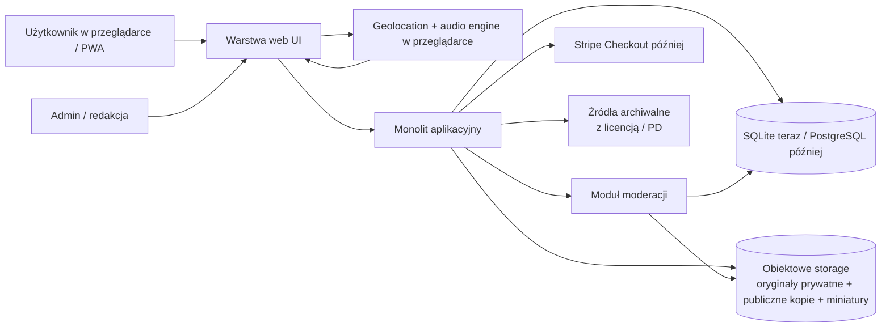
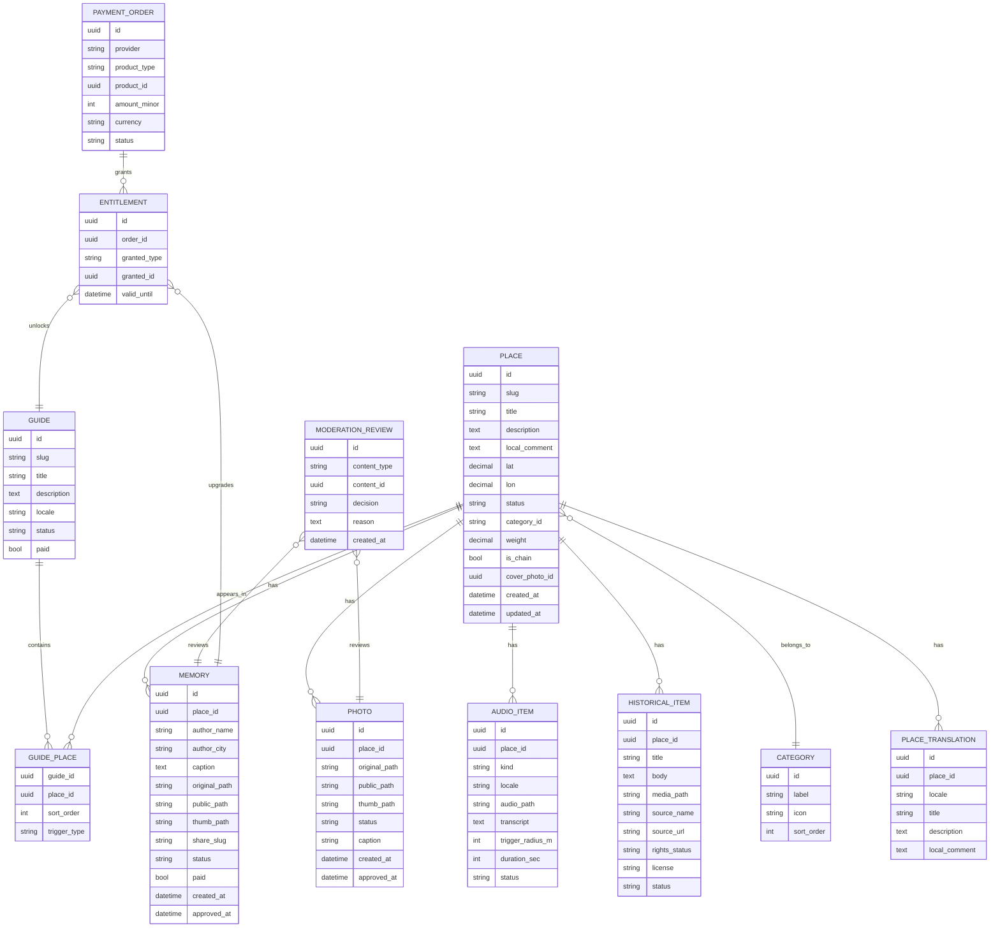

# Wrocławski przewodnik bez ściemy

## Podsumowanie zarządcze

Ta koncepcja ma sens rynkowy, ale tylko wtedy, gdy nie spróbuje zostać „lepszym Google Maps”. Wrocław ma realny popyt turystyczny — miasto podało ponad 7 mln odwiedzających w 2025 roku, 3,9 mln noclegów i szacowane wydatki turystów na poziomie 4,95 mld PLN — a oficjalny portal visitWroclaw już pokazuje, że użytkownicy szukają gotowych inspiracji, tras i planowania zwiedzania. Jednocześnie rynek jest już bardzo silnie obsadzony przez Google Maps, Tripadvisor i aplikacje audio-guide, więc jedyną rozsądną pozycją dla solo-foundera jest wąska, wyrazista nisza: **kuratorski przewodnik po jednym mieście, bez sieciówek, z lokalnym tonem, gotowymi trasami i warstwą „pamięci miejsca”**. citeturn47view0turn39view0turn27view0turn49view0turn40view0turn28view0turn29view0turn50view0

Najmocniejszy rdzeń produktu to nie „społecznościowa mapa” ani „otwarty katalog”, lecz **starannie wybrane miejsca + lokalny komentarz + przewodniki/route collections + mała warstwa historyczna**. To jest relatywnie lekkie operacyjnie, dobrze różnicuje się wobec oficjalnego portalu miejskiego, a zarazem nie wymaga wielkiej skali ruchu, by dawać wartość pierwszemu użytkownikowi. Najbardziej obiecujący kierunek do rozwijania po MVP to **oficjalne audio GPS dla kilku dopracowanych tras**, bo taki model jest już sprawdzony na rynku przez VoiceMap i Action Tour Guide. Najsłabszy kierunek na wczesnym etapie to **otwarte audio-wspomnienia użytkowników**: są ciekawe, ale niosą najwyższy koszt moderacji, największe ryzyko prawne i nie rozwiązują problemu zimnego startu. citeturn39view0turn28view0turn50view0turn32view3turn34view3

Moja rekomendacja techniczna jest jasna: **nie robić pełnego rewrite’u na start**. Z dostępnych materiałów wynika, że WreckScanner ma już elementy bardzo wartościowe dla nowego produktu — mapę Leaflet, piny/popupy, upload zdjęć, miniatury, anonimizację EXIF, rozdział oryginałów prywatnych od publicznych kopii, panel admina i statusy moderacyjne — a to jest dokładnie ten „niewidzialny” ciężar, który najdrożej odtwarza się od zera. Rozsądne podejście to **strangler refactor**: dołożyć nowy byt `place`, ukryć flow wrakowe, przepiąć mapę i media na nowe modele, a dopiero potem usuwać stare moduły. Repo-wnioski mają tu średnią pewność, bo najsilniejszym źródłem repo w tej sesji był szczegółowy brief migracyjny, nie pełny plik-po-pliku przegląd całego GitHuba. fileciteturn0file0

Biznesowo najpierw monetyzowałbym **płatne trasy audio** i **płatne pamiątki/share-cardy „Tu byłem”**, a nie subskrypcję ogólną. Rynek audio-guide’ów pokazuje, że klienci płacą za konkretne trasy i katalogi tras; Action Tour Guide sprzedaje roczny abonament 200+ tras za 99,99 USD, a Tripadvisor sprzedaje „things to do” oraz doświadczenia, zamiast sprzedawać sam dostęp do katalogu. Dla Ciebie to oznacza: najpierw zapłać-mi-za-wartość-jednostkową, później dopiero ewentualny pass/subscription. citeturn50view0turn40view0

## Założenia i punkt wyjścia

Twoja własna dokumentacja ustawia projekt bardzo spójnie: **`place` ma być głównym bytem**, a kategorie, zdjęcia, wspomnienia, audio, historia i przewodniki mają być tylko warstwami przypiętymi do miejsca. Ten dokument wyraźnie stawia też na ton „bez ściemy”, na selekcję anty-sieciówkową oraz na markę w rodzaju **wroclawbezsciemy.pl**, z ewentualnym osobnym use-case’em „Tu byłem” jako funkcją/podmarką. To jest dobra podstawa, bo porządkuje produkt wokół jednego modelu domenowego zamiast wokół przypadkowych feature’ów. fileciteturn0file1

Przyjmuję trzy robocze założenia, bo nie zostały wprost doprecyzowane: **start od jednego miasta**, **budżet niski/umiarkowany**, **wdrożenie jako web app/PWA, nie natywna aplikacja mobilna**. To założenie jest sensowne dla solo-developera także dlatego, że współczesna przeglądarka daje już geolokalizację po zgodzie użytkownika i dojrzały `MediaRecorder` do nagrywania audio, więc da się zbudować działający produkt bez wchodzenia od razu w koszt natywnego iOS/Android. citeturn44view4turn44view5

Punkt wyjścia na poziomie repo również jest dość czytelny. Brief migracyjny opisuje stary system jako aplikację z legacy obszarami YOLO / scan / candidate / report i równocześnie wskazuje, co należy zachować: Leaflet, markery, popupy, upload, miniatury, anonimizację EXIF, public/private asset flow, admin oraz `pending/approved`. To oznacza, że WreckScanner wygląda nie jak „czysty greenfield”, tylko jak **praktyczny monolit z wartościową infrastrukturą mediów i moderacji, lecz z domeną osadzoną w starym problemie biznesowym**. fileciteturn0file0

## Ocena produktu i użytkowników

Największą siłą tej koncepcji jest to, że wygrywa tam, gdzie platformy masowe są z natury słabsze: **nie kompletnością, tylko selekcją**. Google Maps pozwala tworzyć i współdzielić listy miejsc, a Local Guides gamifikuje dodawanie opinii, zdjęć i edycji; Tripadvisor ma ponad miliard recenzji i opinii; oficjalny portal visitWroclaw daje inspiracje, gotowe trasy, plan zwiedzania, link do Google Maps i PDF. To oznacza, że katalog „wszystkiego” już istnieje, ale nadal pozostaje luka na produkt, który mówi: **„nie pokażę Ci wszystkiego, pokażę Ci to, co ma sens”**. citeturn27view0turn49view0turn40view0turn39view0

Produkt ma w praktyce pięć warstw o bardzo różnej wartości i kosztach uruchomienia:

| Warstwa | Wartość dla użytkownika | Trudność dla solo-foundera | Rekomendacja |
|---|---|---:|---|
| Kuratorskie miejsca + filtry + lokalny komentarz | Natychmiastowa, bo pierwszy użytkownik dostaje sensowny przewodnik od razu | Niska–średnia | **Rdzeń MVP** |
| Kolekcje/guide’y/trasy | Bardzo wysoka, bo zamieniają mapę w konkretne use-case’y | Średnia | **Włączyć wcześnie** |
| Zdjęcia i tekstowe wspomnienia | Średnia–wysoka, ale zależna od ruchu i moderacji | Średnia | **Po podstawowej kuracji** |
| Warstwa historyczno-archiwalna | Bardzo wysoka jako wyróżnik PR-owy i „wow effect” | Średnia–wysoka | **Mały pilot wcześnie, skala później** |
| Audio GPS i audio-wspomnienia | Wysoka, ale kosztowna treściowo i UX-owo | Wysoka | **Oficjalne audio po MVP; audio UGC późno** |

Ta kolejność wynika zarówno z Twojej koncepcji place-centric, jak i z tego, jak wyglądają dziś konkurenci: katalogi są pełne, audio-guide’y są sprawdzone, ale bardzo niewiele produktów łączy **kurację lokalną z warstwą pamięci miejsca i historią**. To jest właśnie najbardziej obiecujący kierunek. fileciteturn0file1 citeturn28view0turn29view0turn50view0turn39view0

Segment turystyczny jest ważniejszy niż lokalny na starcie, ale nie dlatego, że lokalsi są mniej cenni. Po prostu turysta ma bardziej „ostry” problem do rozwiązania: ma mało czasu, nie zna miasta, nie chce iść do sieciówek, szuka gotowego wyboru, jedzenia, klimatu i sensownej trasy. Oficjalne dane miasta pokazują 7 mln odwiedzających i szybki wzrost noclegów; dodatkowo oficjalny portal turystyczny już eksponuje kategorie typu zwiedzanie, rower, rejsy, trasy, plan zwiedzania, a nawet trasę do Google Maps. To jest bardzo dobry sygnał, że zachowanie „daj mi wybrany plan, a nie surową mapę” jest realne. citeturn47view0turn39view0

Lokalsi i „semi-lokalsi” są natomiast lepszym segmentem retencyjnym. Obejmują mieszkańców pokazujących miasto znajomym, nowych mieszkańców, studentów, ekspatów i osoby zainteresowane historią dzielnic, murali, barów mlecznych, klimatów „po 22:00” czy dawnych warstw Breslau/Wrocław. W tym segmencie szczególnie dobrze zadziała warstwa historyczna oraz gotowe trasy tematyczne, bo to są rzeczy, których nie używa się raz na city-break, tylko wielokrotnie. Dodatkowym wsparciem dla tego kierunku jest pozycjonowanie gastronomiczne miasta — władze Wrocławia podkreślają wejście miasta do obiegu Michelin i wykorzystują to marketingowo. citeturn48view0turn39view0

Najważniejsza korekta, którą bym wprowadził do Twojej kolejności wdrożeń, jest taka: **rozwinąć bardziej guide’y/trasy niż otwarte wspomnienia użytkowników**. Powód jest prosty: guide daje wartość przy zerowym ruchu, a wspomnienie użytkownika daje wartość dopiero wtedy, gdy masz już użytkowników. Dla solo-foundera trzeba preferować feature’y, które działają przy pustym rynku. fileciteturn0file1

## Konkurencja i pozycjonowanie

Konkurencja jest silna, ale też bardzo „nierówna” — każdy gracz jest mocny w czymś innym, więc nie ma sensu wchodzić z nimi w frontalną wojnę.

| Konkurent | Co robi dobrze | Czego nie warto kopiować wprost | Gdzie możesz wygrać |
|---|---|---|---|
| Google Maps | Listy prywatne i współdzielone, ogromna baza miejsc, crowdsourcing przez Local Guides z punktami za recenzje, zdjęcia i edycje. citeturn27view0turn49view0 | Kompletność katalogu, recenzje wszystkiego, edycje infrastruktury miejskiej | Kuracja „bez sieciówek”, subiektywny lokalny ton, gotowe trasy zamiast chaosu |
| Tripadvisor | Ponad miliard recenzji i opinii, marketplace „things to do”, nagrody i social proof. citeturn40view0turn40view1 | Wielka platforma bookingowa i review marketplace | Miejsca z charakterem, nie doświadczenia masowe; „małe prawdziwe Wrocławie” |
| visitWroclaw / oficjalny przewodnik miejski | Oficjalne atrakcje, route builder, eksport do Google Maps, PDF, sugerowane trasy i inspiracje. citeturn39view0 | Neutralny, promocyjny styl miasta i szeroki „family-safe” przekaz | Szczerość, filtr anty-sieciówkowy, „nie dla każdego”, pamięć miejsca |
| VoiceMap | 2170 tras w 83 krajach, GPS autoplay, offline maps, ekspert-guide’y. citeturn28view0 | Szeroki katalog destynacji | Jeden dopracowany, głęboko lokalny Wrocław |
| izi.TRAVEL | 30 000 tras w 166 krajach i 6500 miastach; szeroka międzynarodowa skala. citeturn29view0 | Globalna biblioteka | Jakość selekcji i spójna marka jednego miasta |
| Action Tour Guide | 200+ GPS self-guided tras, hands-free, offline, roczny pass 99,99 USD. citeturn50view0 | Masowy katalog pakietów i driving tours | Miejski, pieszy, osobisty Wrocław z pamięcią i historią |

W praktyce oznacza to jedno: **nie buduj „lepszego katalogu”, buduj „lepszy filtr”**. Google i Tripadvisor rozwiązują problem „co istnieje?”. Ty powinieneś rozwiązywać problem „co z tego naprawdę warto zrobić w moim czasie, budżecie i nastroju?”. Oficjalny portal miasta rozwiązuje problem „jak elegancko promować Wrocław?”, a Ty możesz rozwiązać problem „jak pokazać Wrocław szczerze i z charakterem?”. Audio-guide’y rozwiązują problem „jak opowiadać trasę?”, a Ty możesz dodać „dlaczego to miejsce coś znaczy dla miasta i ludzi”. citeturn27view0turn40view0turn39view0turn28view0turn50view0

To prowadzi do bardzo konkretnego pozycjonowania: **„Google pokazuje wszystko, my pokazujemy to, co ma klimat; VoiceMap opowiada trasę, my opowiadamy Wrocław z punktu widzenia lokalsa; oficjalny portal daje plan, my dajemy charakter i pamięć miejsca.”** Takie zdanie jest ostre, zrozumiałe i trudne do podrobienia bez zmiany DNA produktu. Potwierdza je również Twoja własna koncepcja produktu i proponowana marka `wroclawbezsciemy.pl`. fileciteturn0file1

## Ryzyka rynkowe, prawne i operacyjne

Najważniejsze ryzyko rynkowe to **cold start treści i wiarygodności**. Użytkownik wejdzie na nowy produkt tylko wtedy, gdy od razu zobaczy wartość porównywalną z jednym dobrym wpisem blogowym albo jedną dobrą trasą z oficjalnego przewodnika. Jeżeli zobaczy pustą mapę z kilkunastoma punktami i mało treści, wróci do Google Maps albo visitWroclaw. Dlatego MVP musi wyglądać na „skończone redakcyjnie”, nawet jeśli jest małe funkcjonalnie. To oznacza małą liczbę punktów, ale z bardzo dobrym opisem i sensownym coverem, a nie dużo pustych pinów. citeturn39view0turn27view0

Drugie ryzyko to **spirala moderacyjna UGC**. Google płaci za crowdsourcing swoją skalą, gamifikacją i ogromnym community; Ty tego nie masz. Jeśli za wcześnie otworzysz wspomnienia zdjęciowe, a szczególnie audio-wspomnienia, szybko zamienisz się w jednoosobowy dział obsługi nadużyć, usuwania treści, rozpatrywania zgłoszeń i odpowiadania na prośby o kasację. To jest dokładnie ten typ kosztu operacyjnego, który zabija produkty robione w pojedynkę. citeturn49view0turn32view5

Trzecie ryzyko to **nadmierna złożoność wizji**. Sam pomysł jest dobry, ale zawiera za dużo równorzędnych osi: mapa, guide’y, zdjęcia, wspomnienia, audio, audio UGC, historia, płatności, pieczątki, wielojęzyczność. Każda z tych warstw oddzielnie jest sensowna, ale naraz tworzą zbyt szeroki front dla jednej osoby. Właśnie dlatego place-centric model z Twoich dokumentów jest kluczowy: chroni przed budowaniem osobnych mini-systemów dla każdej funkcji. fileciteturn0file1

Prawnie najważniejsze jest to, że **zdjęcia ludzi, głos i lokalizacja mogą być danymi osobowymi**. GDPR definiuje dane osobowe jako informacje odnoszące się do zidentyfikowanej lub możliwej do zidentyfikowania osoby, a wprost wymienia także location data; EDPB doprecyzowuje, że wystarczy możliwość identyfikacji bezpośredniej lub pośredniej. Dla Twojej aplikacji oznacza to, że zarówno pseudonim + zdjęcie, jak i głos, jak i geograficzny kontekst relacji „byłem tu”, mogą wejść w obszar ochrony danych. Musisz więc mieć minimum: przejrzystą informację o przetwarzaniu, podstawę prawną, prostą możliwość wycofania zgody, workflow usunięcia treści i sensowną politykę retencji dla materiałów odrzuconych. citeturn32view3turn32view0turn32view4turn32view5

Dla GPS-a ważne są też dwa praktyczne skutki prawne i UX-owe naraz. Po pierwsze, Geolocation API wymaga świadomej zgody użytkownika. Po drugie, autoplay audio z dźwiękiem jest ograniczany przez polityki przeglądarek, więc funkcja „idę i samo mi gada” nie może polegać na cichym odpaleniu strony; użytkownik musi aktywnie uruchomić spacer/audio, inaczej `play()` może zostać zablokowane. To nie jest wada koncepcji, tylko coś, co trzeba dobrze zaprojektować w onboardingu. citeturn44view4turn54view0

Archiwalia wymagają osobnej dyscypliny. W UE podstawowa zasada jest taka, że prawa autora do utworu trwają co do zasady przez życie autora i 70 lat po jego śmierci, a dla niektórych praw pokrewnych obowiązują inne terminy. Równocześnie Creative Commons wyraźnie zastrzega, że nawet materiał oznaczony jako wolny od znanych ograniczeń prawnoautorskich może nadal podlegać innym ograniczeniom: prawom prywatności, prawom do wizerunku, lokalnym różnicom jurysdykcyjnym czy prawom osobistym autora. W praktyce dla Ciebie oznacza to prostą zasadę: **używaj tylko materiałów z wyraźnym statusem licencyjnym/proweniencyjnym i zapisuj źródło, status praw i datę w modelu danych**. citeturn34view1turn34view2turn34view3

Audio narracyjne i audio-wspomnienia również nie są „wolne z definicji”. Dyrektywa o czasie ochrony praw autorskich i pokrewnych przewiduje odrębne prawa dla wykonawców i producentów fonogramów. W praktyce: jeśli zamawiasz lektora, potrzebujesz umowy obejmującej nie tylko sam głos, lecz także nagranie, reprodukcję, wykorzystanie online/mobile, tłumaczenia i ewentualne przeróbki do wersji językowych. Jeśli dopuszczasz audio UGC, treści muszą mieć warunki publikacji, moderacji i zgłaszania naruszeń. citeturn34view1

## Wykonalność techniczna i rekomendacja dla repo

Technicznie ten produkt jest **jak najbardziej wykonalny jako web app/PWA**. Leaflet pozostaje lekką, mobilnie przyjazną biblioteką do map. Geolocation API jest powszechnie dostępne i daje dostęp do GPS-u po zgodzie użytkownika. `MediaRecorder` działa szeroko od lat i nadaje się do krótkich audio-wspomnień. Największa pułapka nie leży więc w „czy to się da”, tylko w tym, że audio autoplay z dźwiękiem wymaga gestu użytkownika — dlatego poprawny produktowy wzorzec to nie pełna automagia, tylko **przycisk „Start spacer” / „Włącz przewodnik” + dalsze automatyczne triggery po trasie**. citeturn44view2turn44view4turn44view5turn54view0

Drugi ważny wniosek dotyczy danych i infrastruktury. SQLite jest tu świetne na start, bo nie ma osobnego serwera, jest zero-konfiguracyjne, działa dobrze dla większości stron o niskim i średnim ruchu, ale oficjalnie pozwala tylko na jednego writera naraz per plik bazy. To dokładnie pasuje do solo-developera i niewielkiej moderowanej aplikacji miejskiej. Moment migracji do Postgresa przyjdzie dopiero wtedy, gdy wzrośnie liczba jednoczesnych zapisów: moderacja, płatności, duży UGC lub wieloosobowa redakcja. citeturn44view1turn56view0

Ważna uwaga operacyjna: jeśli zostajesz przy Leaflet/OpenStreetMap, **nie używaj publicznego `tile.openstreetmap.org` jako produkcyjnego backendu kafli przy rosnącym ruchu**. OSM Foundation wprost przypomina, że dane OSM są wolne, ale publiczne tile serwery mają ograniczoną pojemność i podlegają polityce użycia. W praktyce oznacza to: na start można testować, lecz do publicznego produktu wybierz płatnego dostawcę kafli albo własny hosting tiles. citeturn44view7

Poniższy szkic architektury jest najbezpieczniejszy dla jednej osoby: prosty monolit aplikacyjny, osobne przechowywanie mediów i wolna droga do skalowania tylko wtedy, gdy naprawdę pojawi się potrzeba. To podejście jest zgodne zarówno z Twoją place-centric koncepcją, jak i z dokumentacją FastAPI, SQLite, Leaflet, Geolocation API i polityką OSM. fileciteturn0file1 citeturn44view8turn44view9turn56view0turn44view2turn44view4turn44view7

Z punktu widzenia stacku rekomendowałbym następujący zestaw:

| Element | Rekomendacja MVP | Kiedy eskalować | Dlaczego |
|---|---|---|---|
| Backend/API | **FastAPI monolith** | Rozbicie na osobne serwisy dopiero przy realnym bottlenecku | FastAPI ma automatyczne interaktywne docs i wspiera większe aplikacje z wieloma plikami. citeturn44view8turn44view9 |
| ORM / access layer | **SQLAlchemy 2.0** | Nic nie zmieniaj; ewentualnie dołóż migracje/Alembic | Dojrzały toolkit z ORM i dialektami m.in. dla SQLite i PostgreSQL. citeturn45view1 |
| Baza danych | **SQLite** | **PostgreSQL** przy wielu writerach / płatnościach / większym UGC | SQLite jest prosty i tani, ale wspiera tylko jednego writera jednocześnie. citeturn44view1turn56view0 |
| Frontend mapy | **Leaflet + istniejące JS/HTML repo** | React/Next dopiero, jeśli UI naprawdę zacznie hamować | Leaflet jest lekki i mobilnie przyjazny; ponowne użycie obniża koszt. citeturn44view2 |
| Kafle mapy | **Komercyjny tile provider** | Self-hosted tiles tylko przy dużej skali | Publiczne serwery OSM mają politykę użycia i ograniczoną pojemność. citeturn44view7 |
| Media | **istniejący pipeline upload + thumb + EXIF scrub** | S3-compatible + CDN po wzroście ruchu | To jest już najcenniejsza część starego repo według briefu migracyjnego. fileciteturn0file0 |
| GPS audio | **HTMLAudio + geofencing w przeglądarce** | Native app tylko jeśli offline/background stanie się kluczowe | Web ma geolokalizację, ale audio wymaga jawnego startu przez użytkownika. citeturn44view4turn54view0 |
| Płatności | **Stripe Checkout później** | Billing/subscriptions dopiero po dowodzie PMF | Stripe upraszcza jednorazowe płatności i subskrypcje. citeturn46view0turn46view1 |

Ocena repo na tyle, na ile pozwalają dostępne materiały, wygląda tak:

| Obszar | Ocena | Co robić |
|---|---|---|
| Mapa Leaflet, markery, popupy | **Duży plus** | Zostawić i przepiąć na `places` |
| Upload zdjęć, thumby, EXIF, public/private asset flow | **Bardzo duży plus** | Zachować prawie bez zmian domenowych |
| Admin i `pending/approved` | **Duży plus** | Użyć jako fundament moderacji zdjęć i wspomnień |
| Legacy YOLO / scan / candidate / report / PDF/ZIP | **Słaby fit** | Ukryć z UI, odłączyć od głównego flow, potem usuwać |
| Słownictwo domenowe „wreck / candidate / scan” | **Duży minus** | Wyciąć jak najszybciej z route’ów, UI i modeli |
| Potencjalne file-based metadata i twarde sprzężenie do starej domeny | **Średni minus** | Wprowadzić nowy model `place` i DB layer przed dalszym rozwojem |

To prowadzi do jednoznacznej rekomendacji: **refaktoryzacja z odcięciem starej domeny, nie pełny rewrite**. Rewrite miałby sens tylko wtedy, gdy po wdrożeniu pierwszego nowego slice’a — `places -> mapa -> szczegół miejsca -> zdjęcie` — okaże się, że stare sprzężenia są tak głębokie, iż każda zmiana wymaga grzebania w połowie repo. Na dziś rozsądniej jest założyć, że **najcenniejsze infrastrukturalnie elementy trzeba uratować, a nie spalić**. fileciteturn0file0

Plan adaptacji repo proponuję następujący: najpierw dodać nowy bounded context `places`, następnie wprowadzić SQLite i nowy access layer, potem przepiąć główny widok mapy na `/api/places`, następnie przenieść upload i moderację zdjęć pod `place_id`, dopiero później dodać wspomnienia, guide’y i history layer. Stare moduły wrakowe powinny zostać zamknięte za feature flagą lub po prostu wycięte z nawigacji, ale niekoniecznie fizycznie kasowane w pierwszym sprincie. To minimalizuje ryzyko, że stracisz działające mechanizmy mediów zanim nowy produkt zacznie oddychać. fileciteturn0file0

## Roadmapy oraz model danych

Najpierw krótka teza: **przesunąłbym route collections wyżej niż otwarte wspomnienia użytkowników**. Oficjalny portal miejski już pokazuje, że plan zwiedzania, trasy i inspiracje są natywnym zachowaniem użytkownika; route value nie zależy od ruchu, natomiast UGC zależy. Dlatego moja roadmapa jest trochę bardziej „redakcyjna” niż pierwotny plan. citeturn39view0

| Faza | Obietnica dla użytkownika | Konkretne deliverables | Wysiłek |
|---|---|---|---|
| **MVP minimal** | „Dostajesz najlepsze małe miejscówki we Wrocławiu bez przekopywania się przez sieciówki.” | `places`, `categories`, filtry, mapa, popup/detail page, local comment, cover photo, admin CRUD, status published/draft, 60–80 ręcznie wybranych miejsc, 3–5 gotowych guide’ów/tras, analityka wydarzeń | **Średni** |
| **MVP+** | „Możesz planować zwiedzanie i zostawiać własny ślad.” | publiczne zdjęcia/wspomnienia tekst+foto z moderacją, share-link do pamiątki, PL/EN, 10–20 historycznych kart „kiedyś vs dziś”, proste raportowanie błędów „to miejsce się zmieniło”, pierwsza płatna cyfrowa pamiątka | **Średni–wysoki** |
| **Pełna wizja** | „Idziesz po mieście, a Wrocław opowiada się sam.” | oficjalne audio GPS po trasach, wielojęzyczne warianty audio, audio-wspomnienia użytkowników, płatne trasy audio, entitlement/payments, partnerstwa hostel/hotel, rozbudowana warstwa archiwalna, paszport/pieczątki, ewentualnie offline packs / quasi-native UX | **Wysoki** |

Dla solo-foundera oznacza to w praktyce następujące progi startowe: **MVP minimal nie powinno mieć otwartych kont użytkowników, pełnych płatności ani audio UGC**. Powinno natomiast wyglądać jak zamknięty, świadomie wyredagowany produkt, a nie „beta z pomysłem”. Twoje własne dokumenty dobrze wspierają taką logikę: wszystko ma być warstwą miejsca, a pierwsze wdrożenia mają być wąskie i nie próbować zbudować całej wizji od razu. fileciteturn0file1

Poniższy model danych zachowuje place-centric architekturę i od razu tworzy miejsce na późniejsze warstwy bez przebudowy domeny. To jest dokładnie ten typ „szkieletu”, który pozwala wdrażać dodatki bez chaosu. fileciteturn0file1turn0file0

Najbardziej praktyczna dla Ciebie będzie taka matryca funkcji:

| Funkcja | Minimalne modele backendowe | Minimalne API | Storage | Minimalny UI |
|---|---|---|---|---|
| **Places** | `Place`, `Category` | `GET /api/places`, `GET /api/places/:slug`, `GET /api/categories`, `POST/PATCH /api/admin/places` | SQLite | mapa, filtry, detail page, admin form |
| **Photos** | `Photo`, opcjonalnie `ModerationReview` | `GET /api/places/:id/photos`, `POST /api/places/:id/photos`, `POST /api/admin/photos/:id/review` | oryginał prywatny + public copy + thumb | galeria w detail page, admin queue |
| **Memories** | `Memory`, `ModerationReview` | `GET /api/places/:id/memories`, `POST /api/places/:id/memories`, `POST /api/admin/memories/:id/review` | jak wyżej + `share_slug` | formularz „tu byłem”, card wspomnienia, strona share |
| **Audio items** | `AudioItem` | `GET /api/places/:id/audio`, `POST /api/admin/audio`, `PATCH /api/admin/audio/:id` | plik audio + transcript | przycisk „Posłuchaj przewodnika” |
| **Guides / trasy** | `Guide`, `GuidePlace` | `GET /api/guides`, `GET /api/guides/:slug`, `POST /api/admin/guides` | SQLite | lista guide’ów, guide page, kolejność miejsc |
| **Historical items** | `HistoricalItem` | `GET /api/places/:id/history`, `POST /api/admin/history` | media + pola źródła/licencji | karta „kiedyś i dziś”, overlay gallery |
| **Moderation** | `ModerationReview`, `Report` | `GET /api/admin/moderation`, `POST /api/report` | SQLite | kolejka moderacji, przyciski approve/reject/report |
| **Payments** | `PaymentOrder`, `Entitlement`, `Product` lub enum pricing | `POST /api/checkout`, webhook, `GET /api/me/entitlements` | DB + Stripe metadata | checkout, paywall dla guide/audio/share-card |
| **Multilingual support** | `PlaceTranslation`, `GuideTranslation`, `AudioItem(locale)` | `?lang=en`, fallback locale | DB | language switcher |
| **GPS audio playback** | `AudioItem`, opcjonalnie `RouteSession` | `GET /api/guides/:slug/audio` | DB + audio file storage | ekran „Start spacer”, current stop, play/pause, next trigger |

Ta matryca jest celowo mała. Dla Ciebie ważniejsze od „pełni modelu” jest to, by **każda nowa funkcja była dopinana do miejsca**, a nie uruchamiała nowego mikro-świata. To jest największa architektoniczna przewaga Twojej koncepcji i warto jej pilnować bez wyjątku. fileciteturn0file1

## Monetyzacja, wejście na rynek i metryki

Monetyzację układałbym od najbardziej naturalnej do najbardziej ryzykownej. Benchmark rynkowy jest dość czytelny: Action Tour Guide sprzedaje roczny dostęp do 200+ tras za 99,99 USD, a Tripadvisor sprzedaje doświadczenia i „things to do”, czyli wartość jednostkową związaną z podróżą, nie sam fakt istnienia katalogu. To sugeruje, że użytkownik chętniej zapłaci za **konkretny spacer / trasę / pamiątkę**, niż za „subskrypcję przewodnika o Wrocławiu” na starcie. citeturn50view0turn40view1

| Model | Sugerowany poziom cenowy | Komu sprzedajesz | Ocena |
|---|---:|---|---|
| **Płatna trasa audio** | 19–39 PLN / trasa | turyści | **Najlepszy pierwszy model** |
| **Pakiet 3 tras** | 49–79 PLN | turyści city-break / hosty | **Bardzo dobry** |
| **Pamiątka „Tu byłem” premium** | 5–12 PLN foto/share-card | turyści i pary | **Dobry dodatek** |
| **Pamiątka z audio później** | 12–20 PLN | turyści chcący „zostawić ślad” | **Później** |
| **Roczny pass / subskrypcja** | 79–129 PLN / rok | locals / heavy users | **Dopiero po katalogu tras** |
| **B2B dla hosteli / apartamentów** | rozliczenie revshare lub pakiet miesięczny | partnerzy | **Warte testu wcześnie** |
| **Sponsorowane kategorie/sezony** | indywidualnie, zawsze oznaczone | marki lokalne / instytucje | **Tylko ostrożnie i nie w rankingu** |

Nie sprzedawałbym pozycji w rankingu w żadnej formie. To byłoby wprost sprzeczne z podstawową obietnicą produktu i zniszczyłoby najbardziej wartościową rzecz, której Google ani Tripadvisor nie potrafią dać jednym kliknięciem: **wyraźny redakcyjny smak**. Natomiast sprzedaż trasy audio, share-cardu lub partnerstwa dystrybucyjnego nie psuje logiki produktu, bo użytkownik płaci za usługę, a nie za manipulację listą miejsc. fileciteturn0file1

Go-to-market zrobiłbym bardzo „ręcznie”, lokalnie i nierówno, zamiast próbować od razu klasycznego performance marketingu. Najpierw stworzyłbym **50–80 znakomicie opisanych miejsc**, potem **3–5 guide’ów, które da się polecić jednym zdaniem**, a potem poszedł trzema kanałami naraz: partnerstwa z hostelami/apartamentami/free walking tours, lokalne profile Instagram/TikTok z tematyką „gdzie zabrać znajomych spoza miasta”, oraz SEO na kategorie intencyjne typu „bar mleczny Wrocław”, „Wrocław hidden gems”, „Wrocław bez turystycznej ściemy”, „Wrocław kiedyś i dziś”. Oficjalny portal miejski i dane o turystyce pokazują, że popyt na zwiedzanie, jedzenie i route planning jest realny; Twoim zadaniem jest go przechwycić nie skalą, tylko charakterem. citeturn47view0turn39view0turn48view0

Markowo obstawiałbym **Wrocław Bez Ściemy** jako markę główną i **Tu byłem Wrocław** jako nazwę funkcji/share-page, jeśli kiedyś zechcesz to odseparować w komunikacji. To jest lepsze niż neutralne „guide app”, bo od razu komunikuje selekcję i ton. Z trzech nazw, które już wcześniej rozważałeś, właśnie `wroclawbezsciemy.pl` ma najmocniejszą energię redakcyjną, a `tubylemwroclaw.pl` najlepiej nadaje się na pamiątkowy use-case. fileciteturn0file1

Na starcie mierzyłbym bardzo mały, ale konkretny zestaw KPI:

| Obszar | KPI, które naprawdę coś mówią |
|---|---|
| **Supply** | liczba opublikowanych miejsc, % miejsc z cover photo, liczba gotowych guide’ów |
| **Activation** | % użytkowników, którzy otwierają detail page po wejściu na mapę; % uruchomień guide’a |
| **Engagement** | liczba zapisów/udostępnień guide’a, scroll depth w detail page, rozpoczęte spacery |
| **UGC quality** | liczba zgłoszeń wspomnień, approval rate, median time-to-review |
| **History layer** | CTR na „kiedyś i dziś”, średni czas przy karcie historycznej |
| **Audio** | completion rate odcinka, średnia liczba triggerów na spacer, porzucone sesje po pierwszym triggerze |
| **Revenue** | conversion rate na trasę audio, conversion rate na share-card, ARPPU |
| **Retention** | powroty po 7 i 30 dniach, udział użytkowników lokalnych vs turystycznych |

Końcowa rekomendacja jest więc bardzo prosta. **Buduj najpierw mały, wyrazisty, redakcyjny produkt miejski.** Nie zaczynaj od pełnej społeczności, nie zaczynaj od native app, nie zaczynaj od wielkiego audio marketplace’u. Wykorzystaj WreckScanner jako bazę infrastrukturalną, zrób place-centric monolit, wypuść mały katalog + guide’y + trochę historii, a dopiero potem dokładaj wspomnienia, audio i płatności. W tej formie projekt jest ambitny, ale realny dla jednej osoby; w formie „wszystko naraz” byłby zbyt szeroki i zbyt drogi operacyjnie. fileciteturn0file1turn0file0